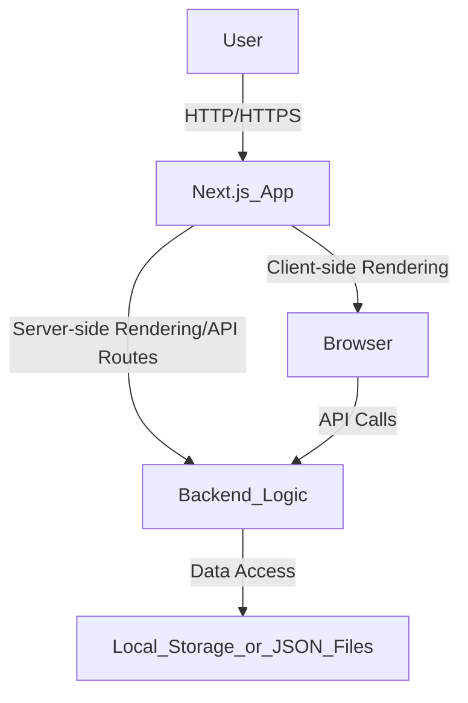

# 技術アーキテクチャ定義

このドキュメントでは、学生向け節約アプリの技術アーキテクチャ、コンポーネント構成、主要インターフェース、および使用技術について定義します。

## 1. 全体アーキテクチャ

本アプリケーションは、Next.jsをベースとしたフルスタックアプリケーションとして構築されます。クライアントサイドはReactとTypeScriptで開発され、サーバーサイドのAPIルーティングはNext.jsのAPI Routesを利用します。データ永続化には、現時点ではローカルストレージまたは簡易的なJSONファイルベースのストレージを検討し、将来的にデータベースへの移行を考慮した設計とします。



## 2. コンポーネント構成

アプリケーションは、以下の主要なコンポーネントに分割されます。

### 2.1. UIコンポーネント (`components/ui/`)
`shadcn/ui` をベースとした再利用可能なUIコンポーネント群。ボタン、入力フィールド、ダイアログ、カードなど。

### 2.2. アプリケーション固有コンポーネント (`components/`)
各ページで利用される、より具体的な機能を持つコンポーネント。
*   `BottomNav`: アプリケーション下部のナビゲーションバー。
*   `PayPayCsvUpload`: PayPay CSVファイルのアップロードと解析を処理するコンポーネント。
*   `ThemeProvider`: アプリケーション全体のテーマ管理。

### 2.3. ページコンポーネント (`app/`)
Next.jsのApp Routerに基づく各ページのルートコンポーネント。
*   `app/page.tsx`: トップページ
*   `app/expenses/page.tsx`: 支出記録ページ
*   `app/map/page.tsx`: 地図ページ
*   `app/notifications/page.tsx`: 通知ページ
*   `app/paypay/page.tsx`: PayPay連携ページ
*   `app/profile/page.tsx`: プロフィールページ
*   `app/subsidies/page.tsx`: 補助金情報ページ
*   `app/tips/page.tsx`: 節約術ページ

### 2.4. ユーティリティ (`lib/`)
アプリケーション全体で利用される共通のヘルパー関数やユーティリティ。
*   `utils.ts`: 汎用的なユーティリティ関数（例: 日付フォーマット、文字列操作など）。

### 2.5. フック (`hooks/`)
Reactのカスタムフック。
*   `use-mobile.tsx`: モバイルデバイス判定フック。
*   `use-toast.ts`: トースト通知管理フック。

## 3. 主要インターフェース

### 3.1. データ構造 (例)

*   **支出データ (`Expense`)**
    ```typescript
    interface Expense {
        id: string;
        amount: number;
        category: string; // 例: 食費, 交通費, 娯楽費
        date: string; // ISO 8601形式 (YYYY-MM-DD)
        description?: string;
        source?: 'manual' | 'paypay';
    }
    ```
*   **PayPay CSVデータ (解析後)**
    ```typescript
    interface PayPayTransaction {
        date: string; // YYYY/MM/DD
        time: string; // HH:MM
        type: string; // 支払い, チャージなど
        amount: number;
        description: string;
    }
    ```

### 3.2. APIエンドポイント (Next.js API Routes)

*   `/api/expenses`:
    *   `GET`: 支出リストの取得
    *   `POST`: 新規支出の追加
*   `/api/expenses/[id]`:
    *   `PUT`: 特定の支出の更新
    *   `DELETE`: 特定の支出の削除
*   `/api/paypay/upload`:
    *   `POST`: PayPay CSVファイルのアップロードと解析
*   `/api/tips`:
    *   `GET`: 節約術リストの取得
*   `/api/subsidies`:
    *   `GET`: 補助金リストの取得

## 4. 使用技術

*   **フレームワーク**: Next.js (App Router)
*   **UIライブラリ**: React
*   **言語**: TypeScript
*   **スタイリング**: Tailwind CSS, shadcn/ui
*   **パッケージマネージャー**: pnpm
*   **データ永続化**: (初期段階) ローカルストレージ / JSONファイル (将来的にデータベース検討)
*   **その他**: `date-fns` (日付操作), `csv-parser` (CSV解析 - 必要に応じて)

## 5. 開発標準

*   **コードフォーマット**: Prettier
*   **リンティング**: ESLint
*   **型チェック**: TypeScript
*   **コミットメッセージ**: Conventional Commits (推奨)
